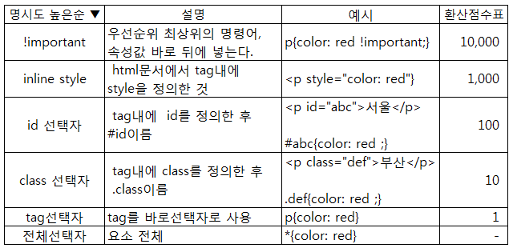

# [Digital Agency](https://www.figma.com/community/file/1257268136779927941) 클론코딩

## 클론코딩하는 방법

> 직접 html, css를 작성한 후, 강사님과 FT님께 피드백을 받아 수정한다.

## 문제 해결

### 헤더 중앙 정렬

#### 문제 코드

```css
position: fixed;
top: 0;

width: 1440px;
height: 5vh;
```

#### 문제 해결 방법

- width 처리
  - width에 직접 px 부여X
  - width:100%, max-width에 직접 px 부여O
- height 처리
  - vh 사용X
  - % 사용 또는 컨텐츠 영역에 맞게 height 설정
- 중앙정렬 처리
  - left:0, right:0 추가

#### 피드백 후 최종 코드

```css
position: fixed;
top: 0;
left: 0;
right: 0;

width: 100%;
max-width: 1440px;
```

### CSS 적용 안됨

#### 문제 상황

main>section에 section1 class를 할당하고, display:none을 진행했으나 적용되지 않는 것을 확인했다.

#### 문제 분석

CSS 점수 중 inline style이 강력하여 class 선택자로 적용한 스타일이 보이지 않았던 것이다.


#### 문제 해결

class를 선택하지 않고, inline style로 선택하여 스타일을 부여했다.

```css
main > section:nth-of-type(1) {
  margin: 148px 104px 104px;
}
```

하지만 해당 방식은 이후의 코드를 작성하는 것에 있어 많은 제약 사항을 가지고 있어, 기존의 코드에 class를 모두 추가했다.

```css
.main .section1 {
  margin: 148px 104px 104px;
}
```
